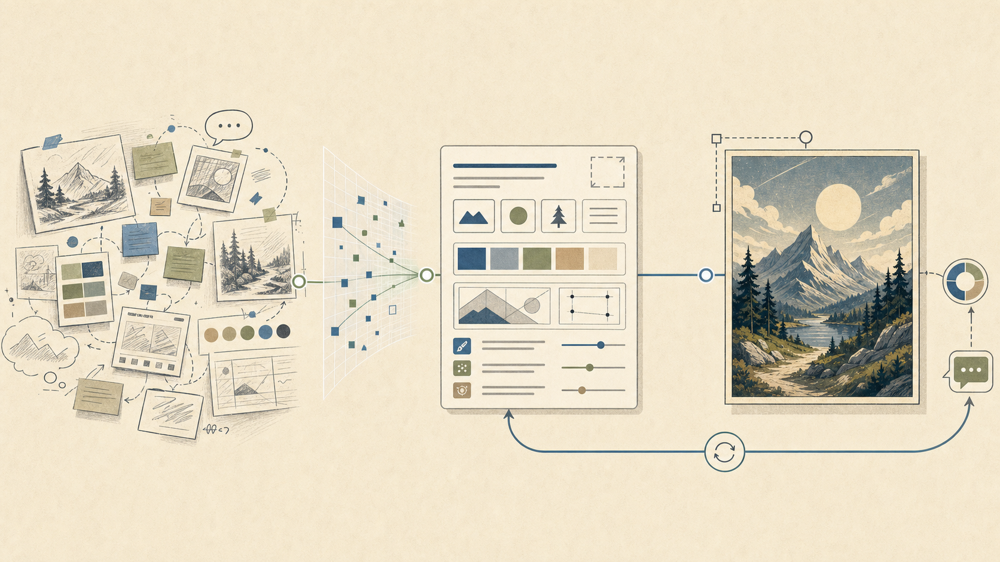

# Codex image prompting skill



Публичный prompt-first skill для Codex Desktop, который помогает превращать
сырой визуальный замысел в сильный промпт для ImageGen, а затем сразу
запускать генерацию или редактирование изображения, если в текущей среде
доступен native image generation.

Идея простая: пользователь может спокойно объяснить словами, что хочет увидеть,
а Codex превращает это в понятный визуальный промпт: формат, композиция,
видимый текст, стиль, ограничения и типичные ошибки.

## Как он работает

1. Codex принимает сырой визуальный запрос.
2. Skill превращает его в структурированный промпт: формат, сетка, текст,
   визуальная иерархия, стиль, ограничения и ожидаемые ошибки.
3. Если пользователь просит именно картинку, Codex показывает или кратко
   фиксирует промпт и запускает native image generation.
4. Пользователь смотрит результат и дает правки; следующий проход упрощает,
   уточняет или меняет промпт.

Так skill закрывает полный цикл: идея -> промпт -> картинка -> итерация.

## Что входит

| Файл | Назначение |
|---|---|
| `skills/codex-image-prompting/SKILL.md` | Skill-инструкция для Codex |
| `skills/codex-image-prompting/references/prompt-patterns.md` | Шаблоны промптов для разных визуальных задач |
| `docs/assets/readme-hero.png` | Нейтральная README-иллюстрация рабочего цикла |
| `examples/prompts/` | Нейтральные примеры промптов |
| `scripts/validate_skills.py` | Проверка структуры и public-safety |

## Когда использовать

Skill полезен, когда нужно подготовить промпт, сгенерировать картинку или
итеративно улучшить визуальный результат для:

- постера, обложки, social card или thumbnail;
- картинки для README или статьи;
- product render или photo scene;
- UI mockup;
- схемы, технической диаграммы или инфографики;
- data visualization concept;
- image edit prompt с сохранением важных элементов;
- карусели для соцсетей.

Skill не запускает локальные генераторы, не просит API keys и не содержит
оберток вокруг image API. Он использует native image generation там, где Codex
его предоставляет. Первая версия специально не добавляет локальный пайплайн
верстки, нарезки, canvas/export или ручного наложения текста.

## Быстрая установка

```bash
git clone <repo-url>
cd codex-image-prompting-skill
python3 scripts/validate_skills.py
scripts/install.sh --dry-run
scripts/install.sh
```

По умолчанию installer копирует skill сюда:

```bash
${CODEX_HOME:-$HOME/.codex}/skills
```

Установить только этот skill:

```bash
scripts/install.sh --skill codex-image-prompting
```

После установки перезапустите Codex, чтобы skill появился в списке доступных.

## Примеры запросов

```text
Use $codex-image-prompting: generate a conference poster about a practical AI workflow. Show me the prompt and the image.
```

```text
Use $codex-image-prompting: generate a UI mockup for a dashboard that turns incoming research notes into tasks.
```

```text
Use $codex-image-prompting: сделай карусель из 5 квадратных слайдов для Threads про то, как команда превращает хаос задач в ясный план. Пусть на каждом слайде будет один короткий крупный заголовок.
```

Готовые примеры лежат в `examples/prompts/`.

## Карусели

Для соцсетей skill по умолчанию предлагает простой путь:

- придумать смысловую дугу на 3-7 слайдов;
- сделать один короткий крупный текст на каждый слайд;
- сгенерировать отдельные квадратные картинки в одном стиле;
- после первого прохода поправить стиль, текст или композицию.

Панорамные или бесшовные карусели можно использовать как визуальный concept,
но первая версия skill не обещает pixel-perfect нарезку и не строит
production-холст. Если нужен финальный дизайн-пайплайн, это отдельная задача за
пределами этого skill.

## Что этот пакет не делает

- Не содержит локального image API wrapper.
- Не настраивает API keys.
- Не заменяет native image generation там, где оно уже есть в Codex.
- Не строит отдельный canvas/export pipeline.
- Не накладывает текст вручную поверх generated images.
- Не гарантирует пиксельно точные seamless-переходы или production-нарезку каруселей.
- Не включает приватные case studies или приватные generated images.

## Атрибуция

Этот пакет вдохновлен prompt-craft подходом из
[`wuyoscar/GPT-Image2-Skill`](https://github.com/wuyoscar/GPT-Image2-Skill),
но не является зеркалом upstream-репозитория и не переносит его CLI/API слой.

Подробности: [NOTICE.md](NOTICE.md).

## Лицензия

MIT. См. [LICENSE](LICENSE).
